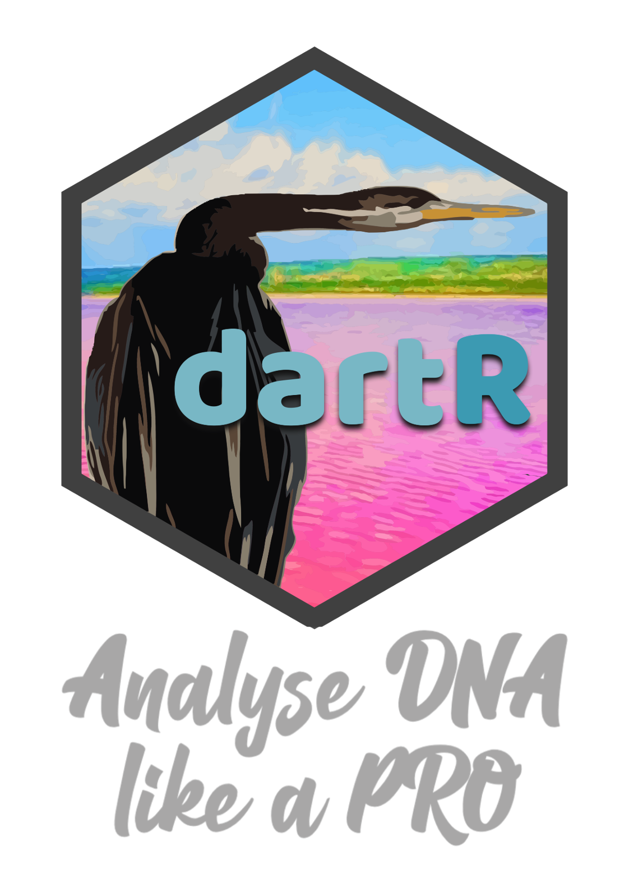
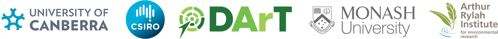

<!-- README.md is generated from README.Rmd. Please edit that file -->

```{r, include = FALSE}
knitr::opts_chunk$set(
  collapse = TRUE,
  comment = "#>",
  fig.path = "man/figures/README-",
  out.width = "100%"
)
```

# `dartR.sim` <a href="https://green-striped-gecko.github.io/dartR/"></a>

## An accessible genetic analysis platform for conservation, ecology and agriculture - dartR.base

<!-- badges: start -->

### Repositories
| repo | status |
|------|--------|
| main |[](https://github.com/green-striped-gecko/dartR.sim/actions/workflows/check-standard.yml)|
| dev |[](https://github.com/green-striped-gecko/dartR.sim/actions/workflows/check-standard.yml) |

Publication:
[](https://doi.org/10.1111/1755-0998.12745)

Zenodo:
[](https://zenodo.org/badge/latestdoi/86640709)


<!-- badges: end -->

## Overview

`dartR.sim` aims to support analysis of SNP data by providing simulation routiner. For example it is fairly straight forward to simulate drift using the gl.sim.offspring function over several generations. The gl.sim.emigration supports the establishment and simulation in a metapopulation context.

Currently the dartRverse consists of the following packages:

-   dartR.base        (report, filter and input/output functions, basic popgen)
-   dartR.data        (example data sets)
-   dartR.sim         (this package)
-   dartR.spatial     (spatial analysis)
-   dartR.popgen (popgen analysis)
-   dartR.captive     (functions to support analysis around captive breeding)
-   dartR.sexlinked    (function to identify sexlinked loci)

`dartR` and its packages is a collaboration between the University of Canberra, CSIRO and
Diversity Arrays Technology, and is supported with funding from the ACT
Priority Investment Program, CSIRO and the University of Canberra.


<p align="center">

</p>


## Installation

For a normal install from CRAN use:
```{r, eval=FALSE}
install.packages("dartR.sim")
```


For hints and how to install github versions, check the help pages of the dartRverse package.

## Contribute

If you want to help shape the future of `dartR`, [this
tutorial](http://georges.biomatix.org/storage/app/media/uploaded-files/Tutorial_0_dartR_for_the_Developer_2.0_19-Feb-22.pdf)
is for you.

## Citation

Please acknowledge `dartR` if you use it in your study. Copy and paste
the following code to the R console to retrieve the citation
information:

```{r, eval = FALSE}
citation("dartR.sim")
```

Check out our
[articles](https://github.com/green-striped-gecko/dartR/wiki/dartR-team-publications)
and our
[awards](https://github.com/green-striped-gecko/dartR/wiki/dartR-awards).

Have fun working with `dartR`!

Cheers,

Bernd, Arthur, Luis, Carlo & Olly
