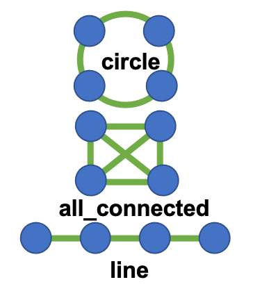

```{r setup, include = FALSE}
knitr::opts_chunk$set(collapse = TRUE, comment = "#>", fig.width = 7,
                      fig.height = 6)
# Files written by the examples go to a temporary directory
knitr::opts_knit$set(root.dir = tempdir())
dartR.base::gl.set.verbosity(0)
```


## Overview

Simulations let you predict how evolutionary forces interact, test competing hypotheses, and check whether a genetic method recovers a value you know (see [Hoban et al., 2012](https://doi.org/10.1038/nrg3130)). The `dartR.sim` package of the **dartRverse** simulates SNP data forward in time under a **Wright–Fisher model** with the five evolutionary forces: **genetic drift, gene flow, natural selection, mutation and recombination**. It can also add **inbreeding** and can start from a real dataset, so the simulated populations have its allele frequencies, differentiation and inbreeding.

In the model, generations are discrete and do not overlap, population size is constant within each phase of the simulation, all individuals reproduce, and the sex ratio is 1:1. Mating is random unless you ask for matings between full siblings. Every stored generation is a `genlight` object, so it can be analysed with any dartRverse function.

The simulations are run in two steps:

1. `gl.sim.WF.table()` builds a **reference table**, with one row per locus.
2. `gl.sim.WF.run()` runs the simulation over that table.

`gl.diagnostics.sim()` then compares a simulation against theoretical expectations.

## Installation

```{r, eval = FALSE}
install.packages("dartRverse")
library(dartRverse)
dartRverse_install("dartR.sim", rep = "CRAN")
```

The development version is installed with `dartRverse_install("dartR.sim", rep = "Github", branch = "dev")`.

## Quick start

```{r}
library(dartR.sim)

ref_table <- gl.sim.WF.table(
  file_var = system.file("extdata", "ref_variables.csv", package = "dartR.sim"),
  interactive_vars = FALSE)

res_sim <- gl.sim.WF.run(
  file_var = system.file("extdata", "sim_variables.csv", package = "dartR.sim"),
  ref_table = ref_table,
  interactive_vars = FALSE)

res_sim$iteration_1$generation_10   # a genlight object
```

## Setting the simulation variables

The simulations are controlled by more than 100 variables. Each function reads them in one of three ways:

| Way | How | When to use it |
|---|---|---|
| Interactive | `interactive_vars = TRUE` (the default) opens a Shiny window. Hover over a variable to see its description; `library(shinyBS)` may be needed for these descriptions. | Exploring the model |
| CSV file | `file_var = "sim_variables.csv", interactive_vars = FALSE` | Reproducible scripts |
| CSV file and arguments | As above, plus any variable as an argument, e.g. `gen_number_phase2 = 50` | Changing a few values of a template |

The templates `ref_variables.csv` (for `gl.sim.WF.table()`) and `sim_variables.csv` (for `gl.sim.WF.run()`) come with the package. Each file describes every variable and its valid range. Copy them to your working directory to edit them:

```{r}
file.copy(system.file("extdata", c("ref_variables.csv", "sim_variables.csv"),
                      package = "dartR.sim"), getwd())
```

Values that are lists are space delimited and quoted, e.g. `population_size_phase2 = "50 50 50"`. A misspelt variable name stops the function with an error instead of being ignored.

The first run takes longer because the C++ helpers are compiled.

## The reference table

`gl.sim.WF.table()` returns a list. Its element `reference` has one row per locus, with these columns:

| Column | Meaning |
|---|---|
| `q` | initial frequency of the simulated allele |
| `h`, `s` | dominance and selection coefficients |
| `c` | recombination rate between the locus and the next one |
| `loc_bp` | position in base pairs |
| `loc_cM` | map position (stored in Morgans, despite the name) |
| `chr_name` | chromosome name |
| `type` | `neutral`, `real`, `deleterious`, `advantageous`, `mutation_neu`, `mutation_del` or `mutation_adv` |

The simulated chromosome is `chunk_number` chunks of `chunk_bp` base pairs and `chunk_cM` centiMorgans each. Each chunk has `chunk_neutral_loci` neutral loci. The number of loci of every other type, and the distributions of `q`, `h` and `s`, are set in `ref_variables.csv`. You can pass a real recombination map (`file_r_map`) and targets of selection (`file_targets_sel`); examples of both are in `system.file("extdata", package = "dartR.sim")`. You can also edit the table by hand before running the simulation.

## The output

`gl.sim.WF.run()` returns a list with one element per iteration (`iteration_1`, …). Each element is a list of `genlight` objects, one per stored generation (`generation_1`, `generation_11`, …). Generations are stored every `every_gen` generations, plus the last one. `sample_percent` sets the proportion of each population that is stored. Each `genlight` holds:

- `@other$loc.metrics`: the reference table (locus type, `s`, `h`, map position).
- `@other$ind.metrics`: sex, father (`pat`) and mother (`mat`).
- `@other$sim.vars`: every variable used, plus the generation, the expected Ne and the census sizes.

`gl.sim.apply()` runs any function on every stored generation and labels each result with its generation:

```{r}
he <- gl.sim.apply(res_sim, gl.He, verbose = 0)
```

## The model, generation by generation

1. **Dispersal** between connected populations, in dispersal generations.
2. **Reproduction.** N/2 monogamous pairs are formed; a proportion `sib_mating` of them are full siblings. Each pair has a negative binomial number of offspring (mean `number_offspring`, size `variance_offspring`), and each offspring's sex is random.
3. **Recombination.** Crossovers are placed along the map with no interference.
4. **Mutation.** New alleles appear at loci of type `mutation_*`.
5. **Selection** (relative or absolute fitness).
6. **The next generation** is formed by sampling N/2 males and N/2 females from the offspring. If there are too few of either sex, the population goes extinct and the iteration stops.

`?gl.sim.WF.run` describes each step in detail.

## Two phases

A simulation can have two phases. Each variable ending in `_phase1` or `_phase2` can differ between them, e.g. a large ancestral population followed by small fragments. Only phase 2 runs by default. Set `phase1 = TRUE` to add phase 1, which is also useful as a burn-in: phase-1 generations are stored only with `store_phase1 = TRUE`.

```{r}
res_sim <- gl.sim.WF.run(file_var = "sim_variables.csv", ref_table = ref_table,
                         interactive_vars = FALSE, phase1 = TRUE,
                         number_pops_phase1 = 2, population_size_phase1 = "200 200",
                         number_pops_phase2 = 2, population_size_phase2 = "50 50")
```

## Genetic drift and effective population size

Drift is not imposed by an equation: it emerges from sampling a finite number of parents and offspring. Its strength depends on the effective population size, Ne, not on the census size, N. Here Ne = 4N / (Vk + 2), where Vk is the variance in the number of offspring an individual leaves in the next generation:

| Parents | Ne / N | Default (`variance_offspring` = 10^6) |
|---|---|---|
| each mates once (`replace_parents = FALSE`) | k / (k + 1) | 1 |
| mate a Poisson number of times (`replace_parents = TRUE`, which produces half siblings) | k / (2k + 1) | ½ |

Here k is `variance_offspring`: smaller values increase the variance in family size and lower Ne. These ratios were checked against the rate at which heterozygosity is lost.

Instead of tuning k, set a target Ne per population with `ne_phase2` (and `ne_phase1`). The function then sets `variance_offspring` to reach it. Family-size variance can only lower Ne, so N must be at least Ne, or 2Ne with `replace_parents = TRUE`; otherwise Ne is capped and a warning is printed.

```{r}
res_sim <- gl.sim.WF.run(file_var = "sim_variables.csv", ref_table = ref_table,
                         interactive_vars = FALSE,
                         number_pops_phase2 = 2, population_size_phase2 = "200 200",
                         ne_phase2 = "50 100", dispersal_phase2 = FALSE,
                         gen_number_phase2 = 30, every_gen = 5)
res_sim$iteration_1$generation_30@other$sim.vars$ne_expected   # "50 100"
```

## Gene flow

`dispersal_type` connects the populations as a `line`, a `circle`, or `all_connected`. In the figure, blue circles are populations and green lines are gene flow.

{width=70%}

Every `transfer_each_gen` generations, each connected pair swaps `number_transfers` individuals in each direction. Dispersers are chosen at random, and no dispersal happens in generation 1. Which sexes move depends on `number_transfers`:
- 2 or more: half males and half females (with an odd number, the extra one is a male).
- 1: one individual, alternating between male and female from one dispersal event to the next.
- 0: that pair is disconnected.

With `all_connected` and n populations, the island model gives an equilibrium FST ≈ 1 / (1 + 4nT) for T transfers per generation, when Ne = N. It does not depend on N, because it is Ne·m, not m, that sets FST.

```{r}
res_sim <- gl.sim.WF.run(file_var = "sim_variables.csv", ref_table = ref_table,
                         interactive_vars = FALSE,
                         number_pops_phase2 = 3, population_size_phase2 = "50 50 50",
                         dispersal_phase2 = TRUE, number_transfers_phase2 = 2,
                         transfer_each_gen_phase2 = 2)
```

**Different rates for each pair.** `gl.sim.create_dispersal()` writes a table with one row per connected pair. You can then edit `number_transfers` and `transfer_each_gen` for each row, and pass the table with `file_dispersal`:

```{r}
gl.sim.create_dispersal(number_pops = 4, dispersal_type = "all_connected",
                        number_transfers = 1, transfer_each_gen = 1,
                        outpath = getwd())
# edit dispersal_table.csv, then:
res_sim <- gl.sim.WF.run(file_var = "sim_variables.csv", ref_table = ref_table,
                         interactive_vars = FALSE, number_pops_phase2 = 4,
                         population_size_phase2 = "50 50 50 50",
                         dispersal_phase2 = TRUE,
                         file_dispersal = file.path(getwd(), "dispersal_table.csv"))
```

## Natural selection

Locus types with fitness effects:

| Type | Fitness of AA, Aa, aa (a = simulated allele) |
|---|---|
| `neutral`, `real`, `mutation_neu` | 1, 1, 1 |
| `deleterious`, `mutation_del` | 1, 1 − hs, 1 − s |
| `advantageous`, `mutation_adv` | 1, 1 + hs, 1 + s |

An individual's fitness is the product over loci. Selection is on when `selection_phase2 = TRUE`. `natural_selection_model` sets how it acts:

- **`"relative"`** (soft selection). Parents of the next generation are sampled without replacement, with probability proportional to fitness. Selection is weak when the offspring pool is not much larger than N, so raise `number_offspring`; a warning is printed when the pool is less than 3N.
- **`"absolute"`** (hard selection). An offspring survives with probability min(1, fitness / `genetic_load`), and the parents are then sampled at random from the survivors.

**Local and clinal adaptation.**
- `local_adap = "1 3"`: advantageous alleles are under selection only in populations 1 and 3.
- `clinal_adap = "1 5"` with `clinal_strength = 20`: selection weakens by 20% per population along the cline from population 1 to population 5.

```{r}
ref_table_sel <- gl.sim.WF.table(file_var = "ref_variables.csv", interactive_vars = FALSE,
                                 loci_deleterious = 50)
res_sim <- gl.sim.WF.run(file_var = "sim_variables.csv", ref_table = ref_table_sel,
                         interactive_vars = FALSE, selection_phase2 = TRUE,
                         number_offspring_phase2 = 10)
```

## Mutation and recombination

- **Mutation.** With `mutation = TRUE`, each offspring receives a new allele with probability `mut_rate`, at a locus of type `mutation_*` that is not segregating. A locus returns to the pool when its new allele is lost.
- **Recombination.** It follows the map: the mean number of crossovers per gamete equals the map length in Morgans. `recombination_males = FALSE` switches recombination off in males.

## Inbreeding

`sib_mating_phase2` is the proportion of pairs that are brother and sister, as one value or one per population. At equilibrium it gives F = b / (4 − 3b). When families are small (low `number_offspring`), there may be too few brothers and fewer sib matings take place; a warning is printed.

```{r}
res_sim <- gl.sim.WF.run(file_var = "sim_variables.csv", ref_table = ref_table,
                         interactive_vars = FALSE, sib_mating_phase2 = 0.3,
                         population_size_phase2 = "100", number_offspring_phase2 = 20,
                         gen_number_phase2 = 20)
# expected F = 0.3 / (4 - 0.9) = 0.097
```

## Using a real dataset as input

Pass a `genlight` with `x`. These variables choose what is copied from it:

| Variable | Function | What is taken from `x` |
|---|---|---|
| `real_pops` | run | number and names of populations |
| `real_pop_size` | run | census sizes = sample sizes, rounded up to even |
| `real_loc` | table and run | positions of the loci of chromosome `chromosome_name` |
| `real_freq` | table and run | allele frequencies of each population |
| `real_freq_shrink` | run | `"auto"` shrinks the frequencies toward their mean, so that sampling noise in x does not inflate FST among founders |
| `real_migration` | run | transfers per pair and generation from x's FST: T = (1/FST − 1)/(4n) × N/Ne (needs `all_connected`) |
| `real_inbreeding` | run | F = 1 − Ho/He of each population: inbred founders and, when `sib_mating` is empty, b = 4F/(1 + 3F) |
| `inbreeding_founders` | run | the founders' F given directly (e.g. estimated on high call-rate loci) |
| `real_sample_size` | run | stored samples have x's sample sizes, so N can be larger than the sample |

`real_loc` and `real_freq` must have the same value in both functions. `real_loc` needs `x@chromosome` and `x@position`. If your data have them only in `loc.metrics`, copy them over. For the platypus data:

```{r}
library(dartR.sim)
x <- gl.filter.callrate(platypus.gl, threshold = 0.9, verbose = 0)
x <- gl.filter.monomorphs(x, verbose = 0)
x@chromosome <- as.factor(x@other$loc.metrics$Chrom_Platypus_Chrom_NCBIv1)
x@position <- as.integer(x@other$loc.metrics$ChromPos_Platypus_Chrom_NCBIv1)
```

The simulated allele is x's alternative allele (genotype 2). A locus with no calls in a population takes the frequency across all populations. Founders are new individuals drawn from these frequencies, not copies of x's individuals, so x's linkage disequilibrium and relatedness are not carried over.

**Example: a simulated population that reproduces x.** This example keeps x's differentiation, diversity and inbreeding. It uses realistic population sizes, from Ne, and stores samples of x's sizes:

```{r}
ref_x <- gl.sim.WF.table(file_var = "ref_variables.csv", x = x, interactive_vars = FALSE,
                         real_freq = TRUE, chunk_neutral_loci = 0)
res_x <- gl.sim.WF.run(file_var = "sim_variables.csv", ref_table = ref_x, x = x,
                       interactive_vars = FALSE,
                       real_pops = TRUE, real_freq = TRUE,
                       real_freq_shrink = "auto",          # founders' FST = x's FST
                       real_migration = TRUE,              # keeps it over time
                       dispersal_phase2 = TRUE,
                       population_size_phase2 = "200 200 200",
                       ne_phase2 = "60 60 60",             # e.g. from gl.LDNe()
                       real_sample_size = TRUE,            # stores 23, 17 and 41
                       real_inbreeding = TRUE, sib_mating_phase2 = 0,
                       store_founders = TRUE,
                       gen_number_phase2 = 10, every_gen = 5)
```

Two practical points:
- **Heterozygote dropout.** In DArT data, missing heterozygote calls inflate F: in platypus, F falls from 0.04–0.09 at call rate ≥ 0.9 to about 0 at ≥ 0.99. Estimate F on high call-rate loci, pass it with `inbreeding_founders`, and keep all loci in `x` for the frequencies.
- **Ne from `gl.LDNe()`.** Run it on each population separately. With small samples its estimate can be infinite, and then it is of no use as a target.

## Founders, pedigree and family-structured samples

- `store_founders = TRUE` stores the founders, before they reproduce, as `generation_0`. Their `ind.metrics` hold `F_founder`, the proportion of loci identical by descent.
- `store_pedigree = TRUE` returns every individual of every generation, sampled or not, as `attr(res$iteration_1, "pedigree")`, with columns `id`, `pat`, `mat`, `generation`, `pop`, `F_founder` and `in_population`. It lets you trace kinship through ancestors that were not stored.
- `sample_families = "9 15 9"` makes each stored sample, from generation 1 onwards, contain full-sib families of those sizes, like clutches or litters. Each family is drawn from one mating pair's offspring before survival, and the rest of the sample is random; use `;` between populations. `sample_parents = TRUE` also stores each family's parents, who count against the sample size. `number_offspring` must be at least the largest family. A sample of a few families makes unrelated pairs look related, which matters when testing relatedness estimators.

```{r}
res_fam <- gl.sim.WF.run(file_var = "sim_variables.csv", ref_table = ref_table,
                         interactive_vars = FALSE, population_size_phase2 = "100",
                         number_offspring_phase2 = 20, sample_percent = 40,
                         sample_families = "9 15 9", sample_parents = TRUE,
                         store_founders = TRUE, store_pedigree = TRUE,
                         gen_number_phase2 = 2, every_gen = 1)
table(res_fam$iteration_1$generation_1@other$ind.metrics$sample_role)
```

## Checking a simulation

`gl.diagnostics.sim()` plots two things:
- the observed loss of heterozygosity against Crow & Kimura's expectation, for Ne, 1.25Ne, … 2Ne;
- the observed FST against the island-model expectation.

It returns both as tables. `Ne` defaults to the expected Ne stored by the simulation.

```{r}
res <- gl.sim.WF.run(file_var = "sim_variables.csv", ref_table = ref_table,
                     interactive_vars = FALSE, number_pops_phase2 = 2,
                     population_size_phase2 = "100 100", dispersal_phase2 = TRUE,
                     gen_number_phase2 = 50, every_gen = 5)
diag <- gl.diagnostics.sim(res, Ne = 100)
tail(diag$fst)
```

Migration slows the loss of heterozygosity, so with dispersal the observed He should fall more slowly than the curves. The FST expectation needs `all_connected` dispersal or no dispersal.

## Other simulation functions

| Function | What it does |
|---|---|
| `gl.sim.ind()` | Simulates individuals from the allele frequencies of a genlight |
| `gl.sim.ind.af()` | Simulates genotypes from per-population allele frequencies |
| `gl.sim.offspring()` | Simulates offspring of given fathers and mothers (Mendelian inheritance) |
| `gl.sim.emigration()` | Exchanges individuals between the populations of a genlight |
| `gl.sim.mutate()` | Adds mutations at a constant rate |
| `gl.sim.Neconst()` | Simulates a population at mutation–drift equilibrium with constant Ne |
| `gl.report.nall()` | Allelic retention and rarefaction curve as individuals are sampled |
| `gl.sim.apply()` | Runs a function on every generation of a simulation |

## References

- Crow JF, Kimura M (1970) *An introduction to population genetics theory.* Harper and Row.
- Hoban S, Bertorelle G, Gaggiotti OE (2012) Computer simulations: tools for population and evolutionary genetics. *Nature Reviews Genetics* 13: 110–122.
- Takahata N (1983) Gene identity and genetic differentiation of populations in the finite island model. *Genetics* 104: 497–512.
